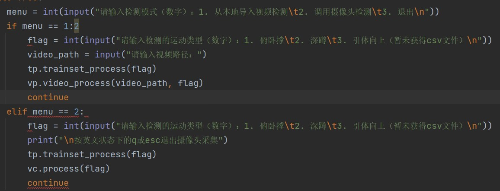

# Kinect-Application

实验三暂定内容：
1）虚拟形象移植到python
2）肢体动作迁移，运动锻炼目的
3）时间充裕的话增加手势和手语识别，否则到大作业时再添加

手势识别数据集 https://www.kaggle.com/datasets/ahmedkhanak1995/sign-language-gesture-images-dataset

# 12-1--12-2改动

# 1）梁总使用mediapipe进行了模块化，该模块可以实时进行关节识别

# 2）梁总通过动作的物理信息进行建模，实现对动作的识别，实现哑铃动作识别

# 3）陈菜狗照葫芦画瓢，实现了俯卧撑识别

# 4）李老师添加自动学习内容，调用接口如下：

# 5）李老师添加三个内容：开合跳，仰卧起坐和跳绳
